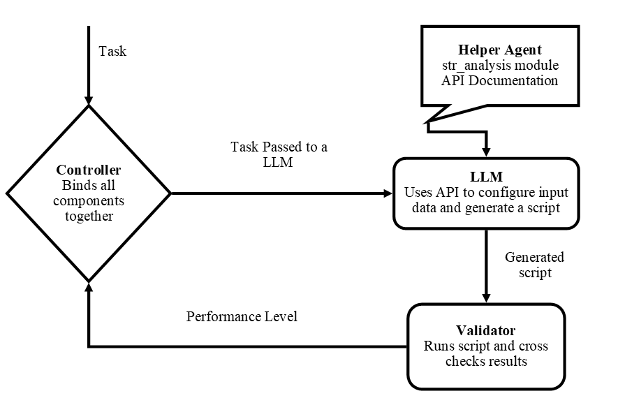
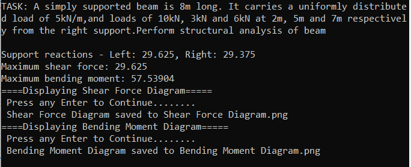
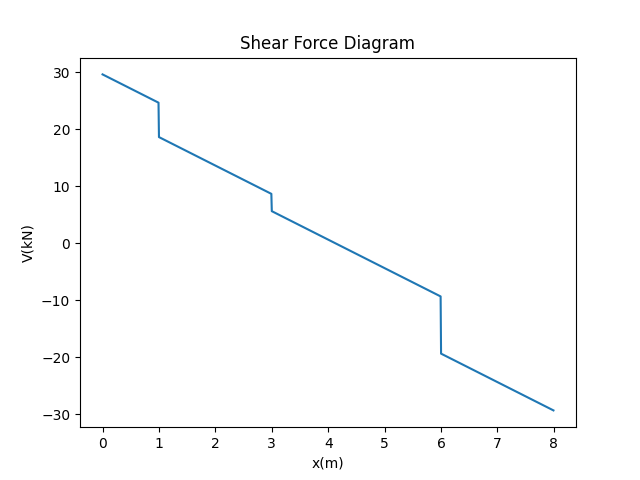
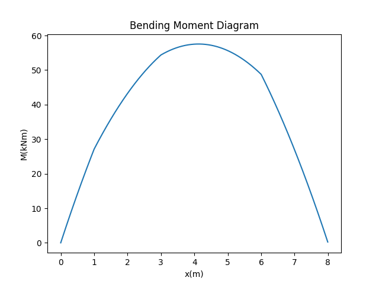

# **Assessing LLM for Structural Analysis of a Simply Supported Beam**

This is a minimalistic project, for which we assess the potential of a LLM for structural analysis of a simply supported beam.  
That is: determination of support reactions, maximum shear, maximum bending moment and visualizing shear and bending moment along the length of the beam.  
The loadings on the beam can be a series uniformly distributed loads and point loads.  
The architecture below was used for the project. The source files  can be found in the **src** folder of this project.

## **Architecture Used**

  

The **LLM** is provided with API documentation of functions and data structures in the **str_analysis** module.  
This module contains functions that know how to perform structural analysis, of a simply supported beam.  
Given a analysis task, the **LLM** is required to generate a script file that contains data structure configuration and api function calls from the **str_analysis** module.  
The generated script is then run by the **Validator**, that then checks the results against expected values.  
The **Validator** assigns a performance level to the **LLM** , and reports result to the **Controller**.

## **Results**

Using the above architecture with ChatGPT 4o as the LLM produced 100% pass rate for the 6 analysis tasks(see **prompts.py** in the src folder).  
Here is a breakdown on how the above architecture handled the one of the tasks.  
  
**TASK:** ***A simply supported beam is 8m long. It carries a uniformly distributed load of 5kN/m, and loads of 10kN, 3kN and 6kN at 2m, 5m and 7m respectively from the right support. Perform structural analysis of beam.***

The LLM was able to comprehend the task and generate a load configuration structure as per str_analysis module API documentation and call the appropriate functions in str_analysis module to perform the structural analysis. As per API documentation, distance of point loads is specified from the left support. Then it passed this data configuration to the anaylsis function.  

``` python
import str_analysis as sa

def analyze_beam(beam_length, load_config):
    # Calculate support reactions
    reactions = sa.calc_support_reactions(beam_length, load_config)
    left_reaction, right_reaction = reactions
    print(f"Support reactions - Left: {left_reaction}, Right: {right_reaction}")

    # Calculate shear force along the beam
    shear_values = sa.calc_shear(beam_length, load_config)
    max_shear = sa.calc_max_shear(shear_values)
    print(f"Maximum shear force: {max_shear}")

    # Calculate bending moments along the beam
    moment_values = sa.calc_bmoment(beam_length, load_config)
    max_bmoment = sa.calc_max_bmoment(moment_values)
    print(f"Maximum bending moment: {max_bmoment}")

    # Draw shear force diagram
    sa.draw_shear_diagram(beam_length, shear_values)
    
    # Draw bending moment diagram
    sa.draw_moment_diagram(beam_length, moment_values)

    #save results
    sa.save_results()
# Given beam details
beam_length = 8  # Beam length in meters
load_config = [ 
    {'lvalue': 5, 'ltype': 'U', 'ldist': 8},   # 5 kN/m UDL along the entire beam
    {'lvalue': 10, 'ltype': 'P', 'ldist': 6},  # 10 kN point load at 2m from the right support (6m from left)
    {'lvalue': 3, 'ltype': 'P', 'ldist': 3},   # 3 kN point load at 5m from the right support (3m from left)
    {'lvalue': 6, 'ltype': 'P', 'ldist': 1}    # 6 kN point load at 7m from the right support (1m from left)
]
# Perform analysis
analyze_beam(beam_length, load_config)
```

### Generated Output

  
  
  

## **A Robust Architecture For Complex Structural Analysis Tasks?**

- The tasks given here were relatively simple. However, it demonstrated that with an appropriate architecture; these LLMs can  be utilizied to write input data configuration files and scripts, calling API of existing structural analysis software to perform structural analysis.
- This architecture automated analysis of a simply supported beam, which would rather take considerable user effort when using directly using an existing structural analysis software.
- The performance of these emerging LLMs should be investigated more on complex structural design tasks, for which a more robust architecture would be required.  
